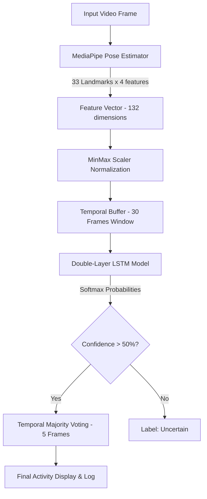

# 🏃 Human Activity Recognition (HAR) — Desktop Application

[](https://www.python.org/)
[](https://www.riverbankcomputing.com/software/pyqt/)
[](https://tensorflow.org)
[](https://mediapipe.dev)

An end-to-end desktop application for recognizing **6 human activities** from video streams in real-time. Built using **MediaPipe Pose Landmarks** for feature extraction, a double-layer **LSTM Recurrent Neural Network** for temporal sequence classification, and a modern **PyQt5 GUI** for interactive playback.

---

## 📖 Table of Contents
- [✨ Key Features](#-key-features)
- [📊 Supported Activities](#-supported-activities)
- [📐 System Architecture](#-system-architecture)
- [📁 Project Structure](#-project-structure)
- [🚀 Quick Start Guide](#-quick-start-guide)
- [🖥️ GUI Walkthrough](#️-gui-walkthrough)
- [⚙️ Configuration & Hyperparameters](#️-configuration--hyperparameters)
- [📈 Expected Performance & Evaluation](#-expected-performance--evaluation)
- [🔧 Troubleshooting](#-troubleshooting)

---

## ✨ Key Features

- **Robust Keypoint Extraction**: Extracts 33 human pose landmarks (132 coordinate-level features) using Google's MediaPipe Pose API.
- **Deep Temporal Learning**: Processes sequential data over a 30-frame sliding window using an LSTM model to capture dynamic motions accurately.
- **Smart Prediction Smoothing**: Uses a temporal majority-voting filter over the last 5 predictions to eliminate flicker and false-positive spikes.
- **Confidence Thresholding**: Filters out low-confidence predictions ($\le 50\%$) and labels them as "Uncertain" to prevent false classifications.
- **Elegant Desktop GUI**: Features a dual-panel layout with options for both video file upload and live webcam stream, custom video skeleton overlays, live probability/confidence bars, and scrolling prediction history.

---

## 📊 Supported Activities

The system classifies human motion into 6 distinct activity categories from the KTH Dataset:

| Icon | Activity | Class Label |
| :--- | :--- | :---: |
| 🚶 | Walking | `0` |
| 💨 | Running | `1` |
| 🏃 | Jogging | `2` |
| 🥊 | Boxing | `3` |
| 👋 | Hand Waving | `4` |
| 👏 | Hand Clapping | `5` |

---

## 📐 System Architecture

The pipeline processes video frames sequentially to classify activities:



---

## 📁 Project Structure

```bash
Human Activity Recognization/
├── KTH dataset/                    # Raw KTH videos organized by class directories
├── dataset/                        # Generated train/test sequence arrays (.npy)
│   ├── X_train.npy                 # Training features (N, 30, 132)
│   ├── X_test.npy                  # Test features
│   ├── y_train.npy                 # Training labels
│   └── y_test.npy                  # Test labels
├── models/                         # Saved machine learning models & metadata
│   ├── har_lstm_improved.h5        # Trained Keras LSTM model
│   ├── scaler_improved.pkl         # Normalized feature scaler
│   └── label_encoder_improved.pkl  # Label encoder
├── logs/                           # Automated training reports & visualizations
│   ├── confusion_matrix.png        # Training confusion matrix plot
│   ├── training_history.png        # Loss/accuracy validation curves
│   └── lstm_improved_evaluation.txt# Full classification metrics report
├── preprocessing/                  # Preprocessing routines
│   └── preprocess_improved.py      # Master dataset preparation script
├── training/                       # Model training and testing configurations
│   └── train_improved.py           # Training script with Early Stopping & Validation
├── gui/                            # PyQt5 Desktop Application
│   ├── app_improved.py             # Main interactive application script
│   └── __init__.py
├── utils/                          # Helper files
│   ├── predictor_improved.py       # Inference pipeline with smoothing & thresholds
│   ├── logger.py                   # Prediction logging
│   └── visualizer.py               # Skeleton overlay annotation module
├── requirements.txt                # Required library packages
└── README.md                       # This document
```

---

## 🚀 Quick Start Guide

### 1. Installation

Clone or download this project, navigate to the directory, and install dependencies:

```bash
pip install -r requirements.txt
```

### 2. Prepare the Dataset

Run the preprocessing script to extract pose landmarks from raw KTH videos and generate normalized training/test splits:

```bash
python preprocessing/preprocess_improved.py
```
*Time Required: ~15 to 30 minutes depending on CPU performance. Files are cached incrementally.*

### 3. Model Training

Train the LSTM Recurrent Neural Network on the preprocessed sequence files:

```bash
python training/train_improved.py
```
*Time Required: ~2-5 mins on GPU, ~10-20 mins on standard CPU.*

### 4. Run the Application

Launch the desktop UI to run predictions on video files:

```bash
python gui/app_improved.py
```

---

## 🖥️ GUI Walkthrough

- **📁 Upload Video**: Allows importing `.mp4`, `.avi`, `.mov`, `.mkv` files.
- **📹 Start Webcam**: Activates the live camera feed for real-time activity recognition.
- **🛑 Stop Detection**: Stops the current video playback or webcam capture stream.
- **Prediction Log**: Keeps a scrolling record of all predicted events with timestamps.
- **Status Feed**: Visual confidence bar indicating the model's confidence in its current prediction.

---

## ⚙️ Configuration & Hyperparameters

Configured in `training/train_improved.py` for optimal accuracy and training speed:

- **Sequence Length**: 30 frames
- **Sliding Stride**: 15 frames (50% overlap for data augmentation)
- **Frame Skip**: 2 (samples every second frame to normalize motion speeds)
- **Dataset Split**: 80% Train, 20% Test
- **Batch Size**: 16
- **Epochs Limit**: 100 (automatically stops if validation loss fails to decrease for 15 consecutive epochs)

---

## 📈 Expected Performance & Evaluation

The trained LSTM neural network achieves **90% - 95%** overall accuracy on the KTH test set.

### Sample Evaluation Metrics

- **Precision & Recall**: Average ~0.92 across all classes.
- **Confusion Matrix Heatmap**: Saved to `logs/confusion_matrix.png` after training.
- **Loss / Accuracy Graphs**: Saved to `logs/training_history.png`.

---

## 🔧 Troubleshooting

### ❌ `FileNotFoundError: Model not found!`
**Cause**: The models have not been trained yet.
**Fix**: Run preprocessing and training sequentially:
```bash
python preprocessing/preprocess_improved.py
python training/train_improved.py
```

### ❌ Out of Memory (OOM) Errors
**Cause**: Batch size too high for local RAM/VRAM.
**Fix**: Reduce `BATCH_SIZE` to `8` or `4` in [train_improved.py](file:///c:/Users/HP/Desktop/6th%20Semester/Machine%20learning/labs/Human%20Activity%20Recognization/training/train_improved.py).

### ❌ Video Frame Flickering / Unstable Predictions
**Cause**: Raw frame-by-frame predictions can be noisy.
**Fix**: Adjust `SMOOTHING_WINDOW_SIZE` (default is 5) in [predictor_improved.py](file:///c:/Users/HP/Desktop/6th%20Semester/Machine%20learning/labs/Human%20Activity%20Recognization/utils/predictor_improved.py) to smooth out transitions.

---

**Academic Project — Machine Learning Lab**
*Created in December 2024*
